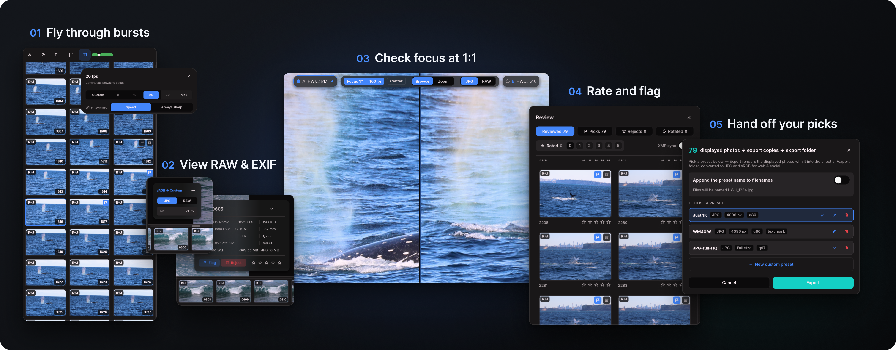
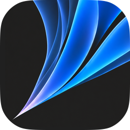

# Falcon Photo Viewer

[](https://slint.dev)

**The photo culler that keeps up with your shutter.**

Falcon is a free, open-source app for the job between the memory card and the editor: looking
through thousands of frames and choosing the keepers. Open a folder, fly through RAW + JPEG bursts
at the speed they were shot, check focus at 1:1, rate, flag and compare, then hand your picks to
Lightroom, Capture One or the web.

I'm a photographer and a designer, and I designed Falcon for my own shoots. This page is both the
project's README and a record of the design thinking behind it.

**Windows 10 and 11 · Apple Silicon Macs · [Download](https://github.com/HWu0101/falcon-photo-viewer/releases)**



## Contents

- [Why I built it](#why-i-built-it)
- [Design principles](#design-principles)
- [Design in practice](#design-in-practice)
- [What Falcon is not](#what-falcon-is-not)
- [The icon](#the-icon)
- [How it was made](#how-it-was-made)
- [Download and first launch](#download-and-first-launch)
- [Requirements](#requirements)
- [Supported files](#supported-files)
- [Keys](#keys)
- [Building from source](#building-from-source)
- [Credits and licence](#credits-and-licence)

## Why I built it

My camera, a Canon EOS R5 Mark II, shoots 30 frames a second. One second of a bird taking off is
thirty photos, and a day's shoot is thousands. Looking through them should be the quick part of the
job. It wasn't.

None of the photo viewers I tried could keep up with that speed. Hold the arrow key and they stall
on a loading screen or a black frame, so a burst that took two seconds to shoot takes far longer to
look through. Most also show a RAW file and its JPEG as two separate images, so every moment has to
be judged twice.

Before building anything, I studied the viewers that already exist. They fell short in three ways:
interaction design, speed with large high-resolution bursts, and working the same way on Windows
and Mac. A feasibility check followed, and I decided to build a new tool.

The first prototype was a web app, built with React. It was nowhere near fast enough for culling,
so the whole app was rebuilt in Rust, which runs natively and can use every processor core and the
graphics card.

## Design principles

Six ideas shaped every decision in Falcon.

**1. Speed is the product.**
A culling tool that makes you wait has failed at its one job. Every change is measured: time to
the first photo, decode times, frame pacing. Anything that makes browsing hesitate is treated as a
defect, not a nuisance.

**2. The photo is sacred.**
Selection, hover and rejection appear around the photo as borders, glows and lifts, never as a tint
over it, because you can't judge colour through a coloured overlay. Colour is managed end to end,
from each photo's embedded profile to your monitor's own profile, and that includes the colours of
the interface itself.

**3. Culling is thinking, not clicking.**
Choosing between near-identical frames means looking and reflecting. Falcon never moves on for you:
there is no auto-advance after a rating and no slideshow timer. An independent design review
recommended auto-advance as its top change, as many culling apps do it. I turned it down, because
the keystroke it saves was never the cost; breaking your concentration is. Falcon removes friction
instead, with instant previews, one-key judgements and short hand travel, and you set the pace.

**4. Designed for people who think visually.**
Photographers, like designers, think with their eyes. No feature in Falcon hides behind a keyboard
shortcut alone. Every action is in the right-click menu, which also shows its key. Panels shrink to
a small visible button instead of disappearing, so there is always a way back.

**5. Folders, not a catalogue.**
There is no import step and no library database to maintain. Falcon opens the folder in front of
you, and remembers your sort order and your place when you come back.

**6. Quiet and consistent.**
The interface is a dark, flat viewing space built from one set of colours, spacing and motion rules.
Motion is restrained and can be switched off. Anything that competes with your photographs is kept
out.

## Design in practice

### Bursts play like video

Hold the arrow key and Falcon moves through the folder at a sustained 30 frames per second, the same
rate my camera shoots. A burst plays back as motion: a wingbeat or a sprinter's stride unfolds on
screen, and you stop on the exact frame you want. Settings go up to 120 frames per second, as fast as
your hardware allows.

The decision behind it: never decode a 45-megapixel file just to show it for a thirtieth of a
second. While you move, Falcon shows screen-sized frames it has prepared dozens of photos ahead, in
the direction you are going. The moment you stop, that photo sharpens to full resolution, and the
frames around it are prepared sharp too, so stepping back and forth around a moment stays instant.

### RAW and JPEG are one photo

Many cameras save each shot twice: a RAW file and a finished JPEG or HEIC. Falcon treats the pair as
one photograph everywhere. It is one frame in the filmstrip, whichever file you opened, and ratings,
flags, copying and deleting act on both files together. Compared with a viewer that shows both
files, there are half as many images to look through, and your judgement belongs to the photograph
rather than to one of its files.

You browse on the camera's finished image and switch to the RAW with one click to see it developed,
including Fujifilm X-Trans files. The switch names the real format of the finished file, such as
JPG, HEIC or PNG. When a RAW has no usable finished image, it says Preview, because that is what you
are looking at.

### A huge folder opens on the photo you clicked

Double-click one photo in a folder of ten thousand and Falcon shows that photo first, before it has
finished reading the folder. You can zoom and pan straight away while the filmstrip and the rest of
the folder fill in behind it. In a test reopening an 11,831-file RAW + JPEG folder, the 45-megapixel
photo was on screen about 0.7 seconds after launch.

To make that possible, Falcon identifies each file from its first 32 bytes and pairs RAW and JPEG
files by name without opening the RAWs. The photo you are looking at always comes first, and all
other preparation gives way to it.

### iPhone photos at full speed

A 48-megapixel iPhone HEIC is made of dozens of compressed tiles, and a folder of them can bring a
computer to its knees. On Windows, Falcon reads the HEIC file itself and sends each tile to the
graphics card's own video decoder, then assembles the tiles and converts the colour on the graphics
card too.

On my NVIDIA desktop, holding the arrow key for 12 seconds through 100 iPhone HEICs prepared all 100
frames, where Windows' own software decoding prepared 11. A sharp frame arrived in a third of a
second instead of 0.84 seconds. The fast path isn't limited to NVIDIA: it uses whatever HEVC video
decoder the graphics driver provides, and Falcon checks folder by folder that it is really serving
your photos before relying on it. On a Mac, HEIC opens natively through Apple's own image framework.

### Compare two frames

Press **C**, or drag a filmstrip thumbnail upward, to put two frames side by side. Zoom and pan stay
linked across both halves, so you inspect the same eye in both at once. Pin the frame you like, then
step through challengers against it. Your rating goes to whichever half you are focused on.

### Also included

- **Focus check in one click.** Click a photo to see true 1:1 at that point. The badge reads
  **Focus 1:1** only when you are really looking at full-resolution pixels.
- **One-key judgements.** Rate, pick and reject with single keys, and undo anything, including
  deletes and moves. Select many photos and the menu says exactly what a key will touch
  ("Reject 40").
- **Review panel.** Filter by picks, rejects or rated shots, with a larger preview on hover.
- **Hand-off.** Copy picks as untouched originals, move rejects aside, or export JPG or PNG copies,
  resized, converted to sRGB and watermarked.
- **Immersive mode.** Press **F** and the interface disappears. Move to a corner and the rating
  controls appear.
- **Safe with your originals.** Falcon never re-encodes your photos. Deletes go to the Recycle Bin
  or Trash with Undo, and your ratings are saved safely beside the photos.
- **Ready for location work.** Efficiency mode stretches a laptop's battery, and photos that live
  only in OneDrive aren't downloaded just because you scrolled past them.
- **At home on a Mac.** The native menu bar and full screen, trackpad pinch to zoom, and Falcon as
  Finder's default viewer.

## What Falcon is not

Falcon is built for one workflow, viewing and culling, and deliberately leaves the rest to other
tools.

- **Not a photo editor.** Crop, exposure and white balance belong in your editor. Rotation is the
  only change Falcon can make to a file, and only when you choose to apply it.
- **Not a catalogue.** There is no import, no cross-folder library and no keyword or face search.
- **A narrow export.** Copies are JPG or PNG in sRGB, for sharing. There is no print module and no
  upload.
- **SDR only.** There is no HDR display output.
- **No screen-reader support yet.**

## The icon



The icon grew out of my own abstract drawings. I set the rules first: one to three simple shapes,
recognisable at 16 pixels in a taskbar or Dock, and a palette of blues. I took passages from my own
pencil drawings, reworked them into clean shapes and refined the mark through several revisions in
Figma until it held up at taskbar size.

## How it was made

I'm the designer, and AI agents were the engineers: mainly Anthropic's Claude, and later OpenAI's
Codex, working under my direction. I made every decision about how Falcon looks, how it behaves and
what it includes. I judged each build on real shoots and fed back with annotated screenshots and
logs from my own laptop and a MacBook tester.

The work ran in rounds: a written plan, the build, independent reviews by other agents, then
verification. Riskier changes were cross-checked between Claude and Codex. Speed claims need a
measurement, and bug fixes start from a test that fails. I reviewed the design against Nielsen's
and Norman's usability principles, and against my own rules, such as "culling is thinking" above.

| When | Milestone |
|---|---|
| 2 July 2026 | The Rust engine replaces the web prototype; development history begins |
| July | Burst browsing, the folder grid, rotation saved to files, and the start of the Mac version |
| 27 July | Per-display colour management |
| 5 August | iPhone HEIC decoding on the graphics card's video decoder |
| 2 September | Windows and Mac merge into one codebase |
| 9 September | Version 1.0.0 |
| October | Version 1.0.11 with the final icon, released as open source |

The private development history holds about 680 commits, and the test suite runs more than 1,700
automated tests.

## Download and first launch

Download Falcon from [Releases](https://github.com/HWu0101/falcon-photo-viewer/releases). Each
release includes the packages, their checksums and the matching source. The packages contain the
app together with its licence and rebuild documents; keep those with the app.

Falcon is free, so it doesn't use paid code signing. Windows builds are unsigned, and Mac builds
have a free ad-hoc signature without Apple notarization, so your system asks you to confirm the
first launch:

- **Windows:** extract the package to the folder where you want to keep Falcon and open
  `Falcon.exe`. If SmartScreen blocks it, choose **More info → Run anyway**. To open photos with
  Falcon from Explorer, use **Settings → File associations → Update**.
- **macOS:** move `Falcon.app` to Applications and open it. If macOS blocks it, go to
  **System Settings → Privacy & Security**, choose **Open Anyway** for Falcon and confirm. macOS
  remembers this choice. See [Apple's instructions](https://support.apple.com/en-ie/102445).

Keep your system's security checks switched on; work computers may not allow these exceptions. The
checksum confirms the download is intact, but it is not a publisher's signature.

## Requirements

- **Windows 10 or 11, 64-bit.** One portable app with no installer. Integrated graphics work.
  NVIDIA acceleration is used automatically when a compatible nvJPEG runtime is installed;
  CPU decoding works without it. HEIC photos need Microsoft's HEIF Image Extensions.
- **macOS 12 or later on Apple Silicon.** HEIC works out of the box.

## Supported files

| Kind | Formats |
|---|---|
| Camera JPEG | JPEG |
| RAW | CR3, CR2, CRW, NEF, NRW, ARW, SR2, RAF, RW2, DNG, ORF, PEF, SRW, IIQ, 3FR, X3F, MRW, ERF |
| Phone | HEIC |
| Other images | PNG and APNG, TIFF, WebP, JPEG XL, BMP, GIF (animated) |

RAW decoding uses [rawler](https://github.com/dnglab/dnglab), so support can vary by camera model.

## Keys

| Key | Action |
|---|---|
| **←** / **→** or mouse wheel | Previous or next photo; hold to play a burst |
| Click | Zoom to 1:1 at that point; click again to fit |
| **1–5**, **0** | Rate; press the same number again to clear it |
| **P** / **X** / **U** | Pick, reject, unmark |
| **N** | Next unrated photo |
| **C** | Compare two photos |
| **S** | Review panel |
| **F** | Immersive mode |
| **Ctrl+Z** (**⌘Z** on a Mac) | Undo, including deletes and moves |

Almost every key can be changed in Settings, and every action is also in the right-click menu.

## Building from source

Full instructions are in [BUILDING.md](BUILDING.md). In short:

```bash
cd falcon
cargo build --locked --release --bin falcon
cargo test --locked --workspace
```

rustup installs the pinned Rust toolchain (1.96.0) automatically. Windows builds also need the
Visual Studio C++ Build Tools and the Windows SDK; Mac builds need Xcode.

Under the hood, the interface is built with [Slint](https://slint.dev) on wgpu: DirectX 12 or Vulkan
on Windows, Metal on Mac. Decoding, colour and graphics work live in Falcon's own crates. NVIDIA
nvJPEG and DirectX hardware HEVC decoding are optional accelerators detected at runtime, with
fallbacks that need no NVIDIA software; CUDA and HEVC software decoders are not bundled. The
repository includes modified copies of the winit window library and zune-jpeg decoder, which the build requires.
Private camera test files are not included, and the tests say when they skip those checks.

The detailed technical guide and architecture diagrams are in [logic.md](logic.md).

## Credits and licence

Designed by Hancheng Wu. Developed with assistance from Claude and Codex.
Copyright 2026 Hancheng Wu and contributors.

Falcon's original project material is licensed under [Apache-2.0](LICENSE). Dependencies keep their
own terms; see [NOTICE](NOTICE), [THIRD-PARTY-NOTICES.txt](THIRD-PARTY-NOTICES.txt) and the
corresponding source materials. RAW development uses rawler under LGPL-2.1, and
[REBUILDING.md](REBUILDING.md) explains how to modify that library and rebuild the app. The Slint
badge above is part of the chosen toolkit attribution route. This software is based in part on the
work of the Independent JPEG Group.

Issues and pull requests are welcome; see [CONTRIBUTING.md](CONTRIBUTING.md). This repository
contains reviewed source snapshots. Private development history, personal photographs and internal
conversation records are not published.
